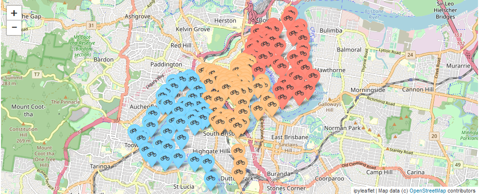

#  Spark k-means clustering

Ce projet a pour but de proposer un clustering de l'emplacement des stations vélos en utilisant la méthode des k-means.
Le projet fonctionne sous jupyter.
Pour exécuter le projet, ouvrir le fichier ```src/kmeans_clustering.ipynb```

## Résultats
Voici comment sont regroupés les différentes stations de vélos dans la ville de Brisbane en Australie. Elles sont réparties en trois groupes (le nombre de groupe correspond à la valeur définie dans le fichier properties.conf), chaque couleur correspondant à un groupe.


